## STEP 1 : INSTALLING THE NGINX WEB SERVER 

  **NGINX is a high-perfomance web server. We install the webServer using `apt`**

`$sudo apt update`

`$sudo apt install nginx`

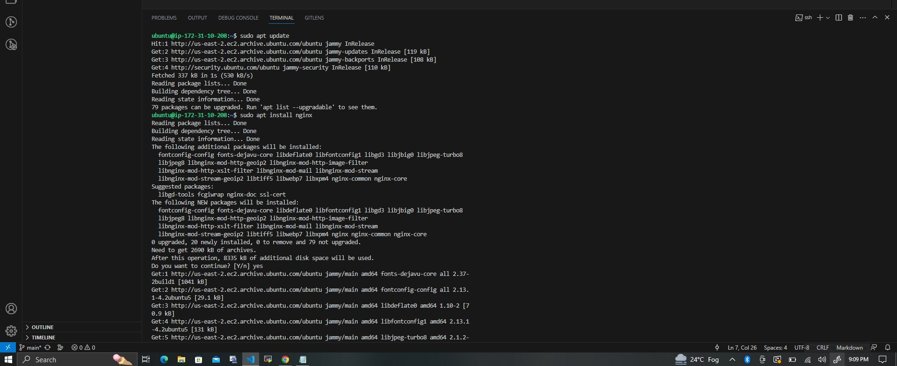

**When Prompted, enter `Y` to confirm Installation.**

**To verify that NGINX was successfully install run ;**

`$sudo systemctl status nginx`

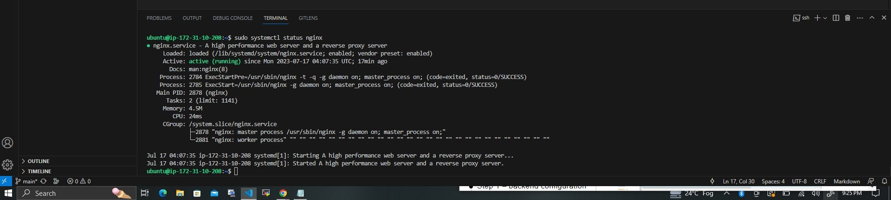

**If it's green and running then, we're good**

**We have just launched our first web Server in the Cloud**

**But before we can receive any traffic by our Web Server, we need to open `TCP port 80` that is the default port web browers use to access web pages in the internet.**

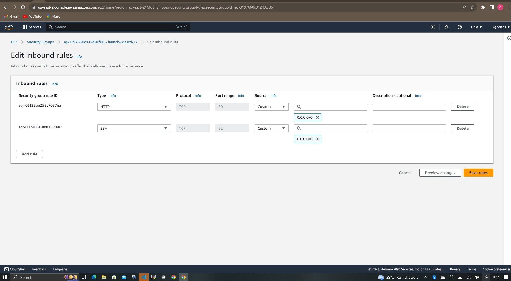

**Our server is running and we can access it locally and from the Internet (Source 0.0.0.0/0 means ‘from any IP address’).**

 **We can access it locally in our Ubuntu shell by running:**

 `$ curl http://localhost:80`

  or

  `$ curl http://127.0.0.1:80`

  **We have to test how our Nginx server can respond to requests from the Internet. Open a web browser of your choice and try to access the url using**

  `http://<Public-IP-Address>:80`

  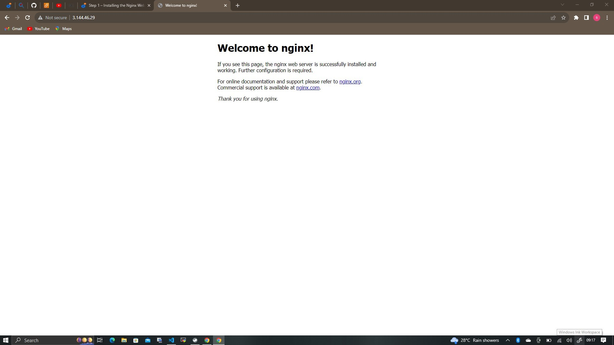

## STEP 2 — INSTALLING MYSQL

**Our webserver is up and running. We need a Database Management System(DBMS) to store and manage data for our site in a relational database MYSQL**

**To install, we `apt`**

`$ sudo apt install mysql-server`

  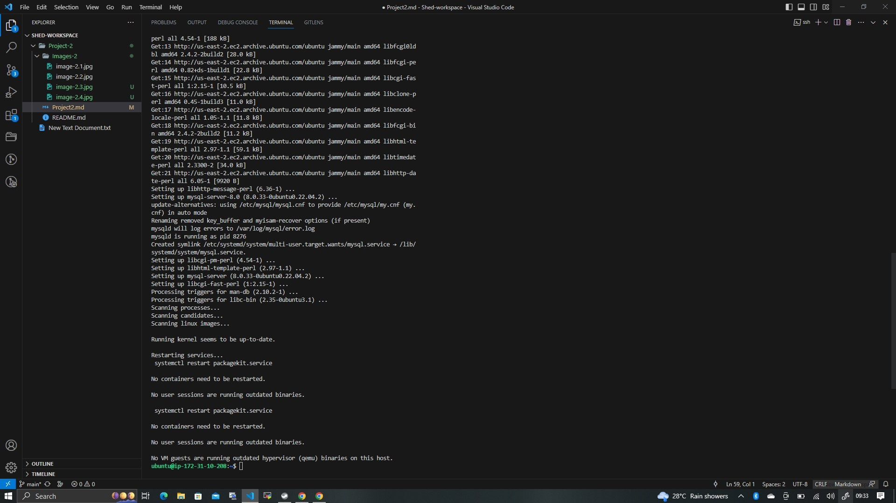

  **We have to login to MYSQL server console by typing:**

  `$ sudo mysql`

  
  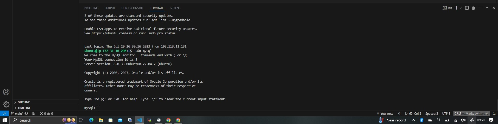

  **It's recommended to run a security script that comes pre installed with MYSQL. Before running the script you will set a password for the root user, using mysql_native_password as default authentication method**

  `ALTER USER 'root'@'localhost' IDENTIFIED WITH mysql_native_password BY 'PassWord.1';`

  **Exit the MySQL shell with:**

  `mysql> exit`

  **To start the interactive script we run;**

  `$ sudo mysql-secure-installation`

  ## STEP 3 – INSTALLING PHP
**WE install PHP to process code and generate dynamic content for the web server**

**To install we run;**

**NOTE:**
While Apache embeds the PHP interpreter in each request, Nginx requires an external program to handle PHP processing and act as a bridge between the PHP interpreter itself and the web server. This allows for a better overall performance in most PHP-based websites, but it requires additional configuration. You’ll need to install php-fpm, which stands for “PHP fastCGI process manager”, and tell Nginx to pass PHP requests to this software for processing. Additionally, you’ll need php-mysql, a PHP module that allows PHP to communicate with MySQL-based databases. Core PHP packages will automatically be installed as dependencies.

`Sudo apt install php-fpm php-mysql`

  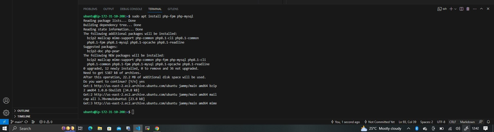

## STEP 4 — CONFIGURING NGINX TO USE PHP PROCESSOR

 WHEN USING NGINX WEB SERVER, WE CAN CREATE SERVER BLOCKS.
 *The Nginx server block allows us to run multiple websites on a single machine.*

 **We will use projectLEMP: On Ubuntu 20.04, Nginx has one server block enabled by default and is configured to serve documents out of a directory at /var/www/html. While this works well for a single site, it can become difficult to manage if you are hosting multiple sites. Instead of modifying /var/www/html, we’ll create a directory structure within /var/www for the your_domain website, leaving /var/www/html in place as the default directory to be served if a client request does not match any other sites.**

 **To create the root web directory for your_domain we run;**

 `sudo mkdir /var/www/projectLEMP`

 We have to assign ownership of the directory with the $USER environment variable.

 **We run;**

 `sudo chown -R $USER:$USER /var/www/projectLEMP`

 **To open a new configuration file in Nginx's sites-available directory using nano we run;**

 `sudo nano /etc/nginx/sites-available/projectLEMP`

 **We paste the command in the blank file**

 #### /etc/nginx/sites-available/projectLEMP

server {
    listen 80;
    server_name projectLEMP www.projectLEMP;
    root /var/www/projectLEMP;

   index index.html index.htm index.php;

    location / {
      
              try_files $uri $uri/ =404;
    }

    location ~ \.php$ {
        include snippets/fastcgi-php.conf;
        fastcgi_pass unix:/var/run/php/php8.1-fpm.sock;
     }

    location ~ /\.ht {
        deny all;
    }

}

**We activate our configuration by linking the config. file fron Nginx sites-enabled directory**

`sudo ln -s /etc/nginx/sites-available/projectLEMP /etc/nginx/sites-enabled/`

**Test for syntax errors by typing**

`sudo nginx-t`

  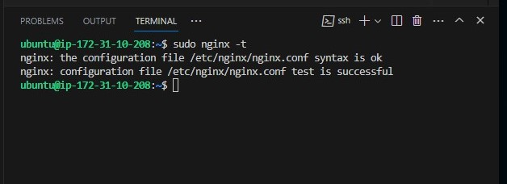

**WE need to disable default Nginx host thats is currently configured to listen on port 80**

`sudo unlink /etc/nginx/sites-enabled/default.`

**Reload Nginx to apply changes**

`sudo sysytemcl reload nginx`

**The website is active now, but the web root `/var/www/projectLEMP` is still empty. We create an index.html file in that location so we test that the new server block works as expected:**

`sudo echo 'Hello LEMP from hostname' $(curl -s http://169.254.169.254/latest/meta-data/public-hostname) 'with public IP' $(curl -s http://169.254.169.254/latest/meta-data/public-ipv4) > /var/www/projectLEMP/index.html`

**Open the website URL using IP address, and we should see the text from `echo`**

  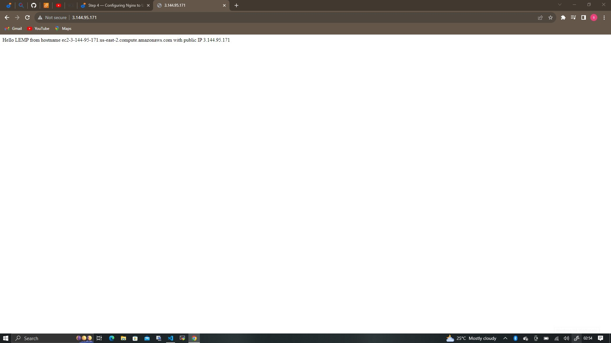

  **LEMP stack is fully configured. next step is to create a PHP script to test that Nginx is able to handle `.php` files within the newly configured website.**

## STEP 5 – TESTING PHP WITH NGINX

**Create a test PHP file in our document root. We open a new file called `info.php` RUN;**

`sudo nano /var/www/projectLEMP/info.php`
**Then paste in**

`<?php
phpinfo();`

**Access the page on web browser using the domain name or IP we set uo in Nginx configuration followed by `/info.php`**

  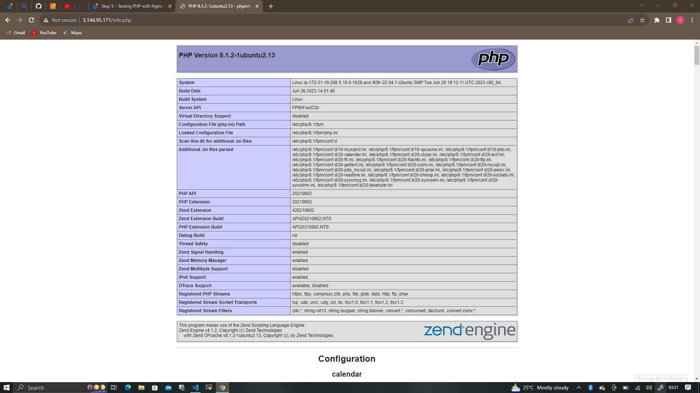

  **It’s best to remove the file you created as it contains sensitive information about your PHP environment and Ubuntu server. we use `rm` to remove files. RUN;**

 `sudo rm /var/www/your_domain/info.php`

## STEP 6 – RETRIEVING DATA FROM MYSQL DATABASE WITH PHP 

**We will create a test database(DB) with sample "To do list" and configure access to it**

**First, connect to the MySQL console using the root account:**
 
 `sudo mysql`

**To create a new database, run the following command from your MySQL console:**

`mysql> CREATE DATABASE `example_database`;`

  **This command will create a new user named example_user using mysql_native_password as default authentication method. We should define this user's password as "Password"   Run :**

`mysql>  CREATE USER 'example_user'@'%' IDENTIFIED WITH mysql_native_password BY 'password';`

**Next, will need to give this user permission over the example_database database:**

`mysql> GRANT ALL ON  example_database.* TO 'example_user'@'%';`

**It will give example_user full privileges over the example_database database, while preventing this user from creating or modifying other databases on our server.**

`mysql> exit`

**You can test if the new user has the proper permissions by logging in to the MySQL console again, this time using the custom user credentials:**

`mysql -u example_user -p`

**the `-p` flag will prompt for the password used when creating the `example_user` user. After logging in to the MySQL console, confirm that you have access to the example_database database:**

`mysql> SHOW DATABASES;`

  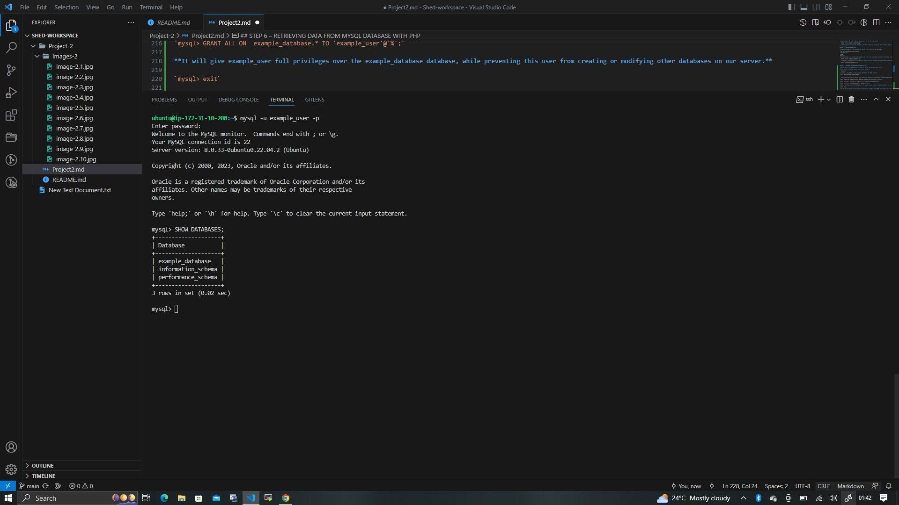

  Create a test table named **todo_list** from MySQL console.

  `CREATE TABLE example_database.todo_list (item_id INT AUTO_INCREMENT,content VARCHAR(255),PRIMARY KEY(item_id));`

  **To insert a few rows of content in the test table You might want to repeat the next command a few times, using different VALUES:**

`mysql> INSERT INTO example_database.todo_list (content) VALUES ("My first important item");`

**To confirm the data was successfully saved run:**

`mysql> SELECT * FROM example_database.todo_list;`

  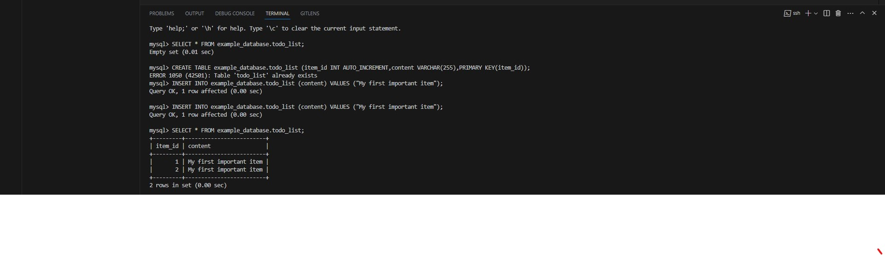

  `mysql> exit`

  **Now you can create a PHP script that will connect to MySQL and query for your content. Create a new PHP file in your custom web root directory using your preferred editor. We’ll use vi for that:**

  `nano /var/www/projectLEMP/todo_list.php`

**The following PHP script connects to the MySQL database and queries for the content of the todo_list table, displays the results in a list. If there is a problem with the database connection, it will throw an exception.**

Then copy this content into your `todo_list.php` script

`<?php`
`$password = "password";`
`$database = "example_database";`
`$table = "todo_list";`
`try {`
  `$db = new PDO("mysql:host=localhost;dbname=$database",` `$user, $password);`
  `echo "<h2>TODO</h2><ol>";`
  `foreach($db->query("SELECT content FROM $table") as $row) {`
    `echo "<li>" . $row['content'] . "</li>";`
  }
  `echo "</ol>";`
`} catch (PDOException $e) {`
    `print "Error!: " . $e->getMessage() . " ";`
    `die();`
}

**We can access  this page in your web browser by visiting the domain name or public IP address configured for your website, followed by /todo_list.php :**

`http://<Public_domain_or_IP>/todo_list.php`
